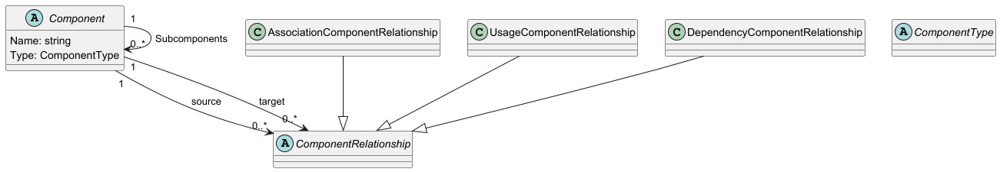
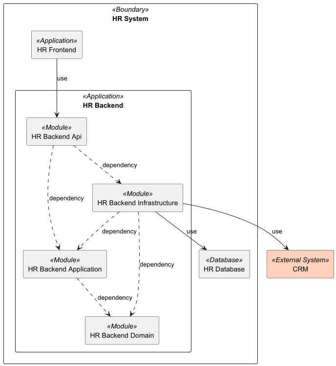

# Components

## Example

See full example [here](../../../src/Samples/Components/Modeler.ComponentsModel.Sample).

## Metamodel



## Design

### Component types

Define component types as follows:

```csharp
public record ApplicationComponentType : ComponentType
{
    public ApplicationComponentType() : base("Application")
    {
    }
}
```

### Components

When you have component types, you can define components. Components are defined in hierarchical structure as follows:

```csharp
public class HRSystemBoundary : Component
{
    private HRSystemBoundary() : base("HR System", new BoundaryComponentType())
    {
    }

    public static Component Create() => ComponentBuilder
        .Create(new HRSystemBoundary())
        .AddChild(new HRBackendApplication(), backendComponent => backendComponent
            .AddChild(new HRBackendApiModule())
            .AddChild(new HRBackendDomainModule())
            .AddChild(new HRBackendInfrastructureModule())
            .AddChild(new HRBackendApplicationModule()))
        .AddChild(new HRFrontendApplication())
        .AddChild(new HRDatabase())
        .Build();
}
```

### Relationships

Components have relationships between each other. To create relationships you must create one or many relationships models as follows:

```csharp
public class HRSystemRelationshipsModel : RelationshipsModel
{
    public static void Create(SystemComponentsModel model)
    {
        var api = model.GetComponent<HRBackendApiModule>();
        var frontend = model.GetComponent<HRFrontendApplication>();
        var database = model.GetComponent<HRDatabase>();
        var domain = model.GetComponent<HRBackendDomainModule>();
        var infrastructure = model.GetComponent<HRBackendInfrastructureModule>();
        var application = model.GetComponent<HRBackendApplicationModule>();
        var crm = model.GetComponent<CRM>();

        model.AddUsageRelationship(frontend, api);
        model.AddDependencyRelationship(api, application);
        model.AddDependencyRelationship(api, infrastructure);
        model.AddDependencyRelationship(application, domain);
        model.AddDependencyRelationship(infrastructure, domain);
        model.AddDependencyRelationship(infrastructure, application);
        model.AddUsageRelationship(infrastructure, database);
        model.AddUsageRelationship(infrastructure, crm);
    }
}
```

## Views

### PlantUML

#### Components diagram

You can create PlantUML components diagram using `PlantComponentsDiagramViewGenerator` by defining class as follows:

```csharp
public class SystemComponentsView : ComponentsDiagramViewDefinition
{
    public const string Id = "SystemComponents";
    
    public static ComponentsDiagramView Create(SystemComponentsModel model)
    {
        var concepts = new List<Component>();

        concepts.Add(model.GetComponent<HRSystemBoundary>());
        concepts.Add(model.GetComponent<CRM>());
        
        var view = new ComponentsDiagramView(Id, concepts);

        return view;
    }
}
```

What you need to do is just selecting which components do you want to show on the diagram. All nested components will be shown automatically.

Output:



##### Defining layout

You can modify a layout settings by implementation of `IComponentsDiagramViewLayout` interface as follows:

```csharp
public class ComponentsDiagramDefaultViewLayout : IComponentsDiagramViewLayout
{
    public string GetComponentTypeColor(ComponentType componentType)
    {
        return componentType switch
        {
            ExternalSystemComponentType => "#FFD2BE",
            _ => string.Empty
        };
    }

    public int IndentSize => 4;
}
```

### AsciiDoc

#### List of components table

You can generate list of all defined components in a form of table. Just use `AsciiDocComponentsListTableViewGenerator`.

Output: [Ascii Doc Components Table List](ComponentsList.adoc)

#### Component details

You can generate details of specific component using `AsciiDocComponentsDetailsViewsGenerator` by defining a view:

```csharp
public class AsciiDocBackendDetailsViewDefinition : AsciiDocComponentDetailsViewDefinition
{
    public const string Id = "BackendDetailsView";
    public static AsciiDocComponentDetailsView Create(SystemComponentsModel model)
    {
        return new AsciiDocComponentDetailsView(Id, model.GetComponent<HRBackendApplication>());
    }
}
```

This will generate list of all related components - see [Component Details](BackendDetails.adoc)