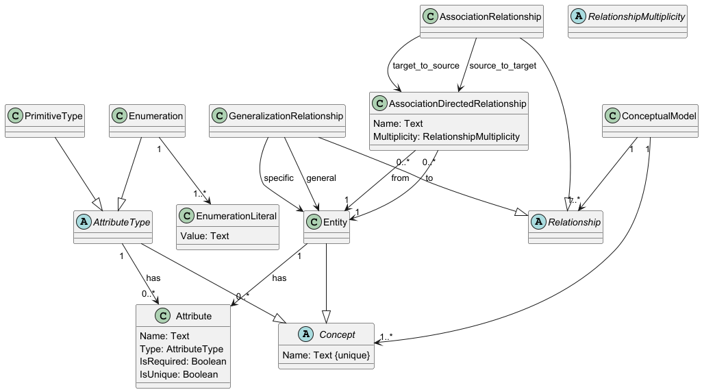
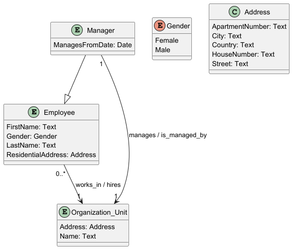
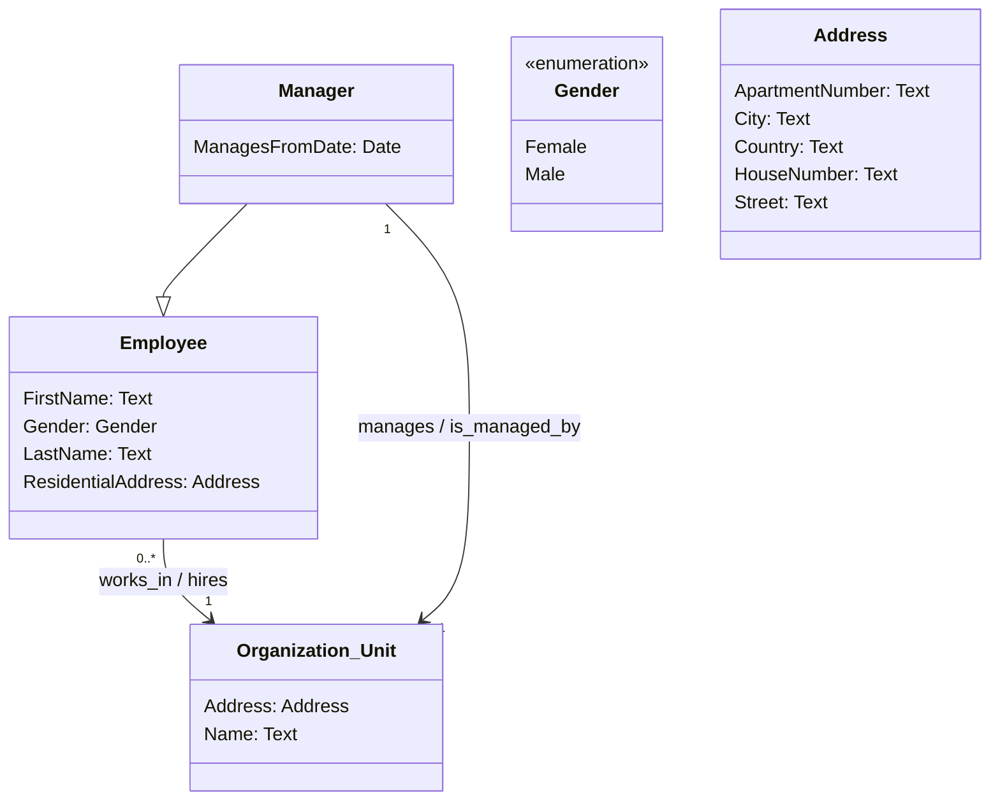

# Conceptual

## Example

See full example [here](../../../src/Samples/Conceptual/Sample).

## Metamodel



## Design

### Concept types

You can have 3 types of concept types:

* Primitive (like string, number)
* Complex (has own attributes)
* Enumeration

Define concept types as follows:

```csharp
public class Text : PrimitiveType
{
    public static PrimitiveType Create() => new Text().WithName("Text");
}
```

```csharp
public class Address : ComplexAttributeType
{
    public static ComplexAttributeType Create() => new Address()
        .WithName("Address")
        .WithAttribute("Street", Text.Create())
        .WithAttribute("HouseNumber", Text.Create())
        .WithAttribute("ApartmentNumber", Text.Create())
        .WithAttribute("City", Text.Create())
        .WithAttribute("Country", Text.Create());
}
```

```csharp
public class Gender : EnumerationType
{
    public static EnumerationType Create() => new Gender()
        .WithName("Gender")
        .WithValues("Male", "Female");
}
```

### Entities

When you have concept types, you can define entities:

```csharp
public class Employee : Entity
{
    public static Entity Create() => new Employee()
        .WithName("Employee")
        .WithAttribute("FirstName", Text.Create())
        .WithAttribute("LastName", Text.Create())
        .WithAttribute("Gender", Gender.Create())
        .WithAttribute("ResidentialAddress", Address.Create());
}
```

### Relationships

Last thing to do is defining relationships between concepts (entities). To do this you must define one or many relationships models as follows:

```csharp
public class OrganizationStructureRelationshipsModel : RelationshipsModel
{
    public static void Create(OrganizationStructureConceptualModel model)
    {
        var employee = model.GetEntity<Employee>();
        var manager = model.GetEntity<Manager>();
        var organizationUnit = model.GetEntity<OrganizationUnit>();

        model.AddAssociation(
            AssociationBuilder
                .Where(employee, "works_in", new One(), organizationUnit)
                .AndInOpposite("hires", new ZeroOrMany()));
        
        model.AddGeneralization(employee, manager);
        
        model.AddAssociation(
            AssociationBuilder
                .Where(manager, "manages", new One(), organizationUnit)
                .AndInOpposite("is_managed_by", new One()));
    }
}
```
## Views

### PlantUML & Mermaid

#### Class diagram

You can create PlantUML or Mermaid class diagram using `PlantUmlClassDiagramViewGenerator` or `MermaidClassDiagramViewGenerator` by defining class as follows:

```csharp
public class OrganizationStructureView : ClassDiagramViewDefinition
{
    public const string Id = "OrganizationStructure";
    
    public static ClassDiagramView Create(OrganizationStructureConceptualModel model)
    {
        var concepts = new List<VisibleEntity>();
        
        concepts.Add(new VisibleEntity(model.GetEntity<Employee>()));
        concepts.Add(new VisibleEntity(model.GetEntity<OrganizationUnit>()));
        concepts.Add(new VisibleEntity(model.GetEntity<Manager>()));
        
        var view = new ClassDiagramView(Id, concepts);

        return view;
    }
}
```

What you need to do is just selecting which entities do you want to show on the diagram. All related concept types will be shown automatically.

PlantUML output:



Mermaid output:



### AsciiDoc

#### Concept details

You can generate details of specific concept using `AsciiDocViewsGenerator` by defining a view:

```csharp
public class ManagerAsciiDocView : AsciiDocViewDefinition
{
    public const string Id = "Manager";
    
    public static AsciiDocView Create(Model model)
    {
        var concept = model.GetEntity<Manager>();
        
        var view = new AsciiDocView(Id, concept);

        return view;
    }
}
```

This will generate:

* Attributes of the concept.
* Relationships of the concept

See [Manager Concept Details](Manager.adoc)