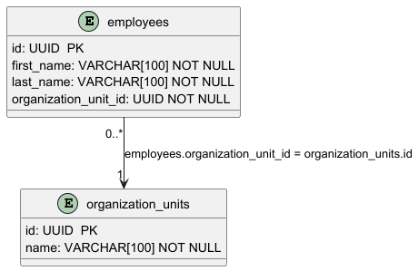

# Data

## Example

See full example [here](../../../src/Samples/Data/Modeler.DataModel.Sample).

## Metamodel


## Design

### Schemas

Define schemas as follows:

```csharp
public class OrganizationSchema : Schema
{
    public OrganizationSchema()
    {
        this.Name = "organizations";
    }
}
```

### Column Types

Because of different database engine can have different types (or event custom one), you need to define them as follows:

```csharp
public class Integer : ColumnType
{
    public Integer() 
        : base("INT")
    {
    }
}
```

```csharp
public class Varchar : ColumnType
{
    public Varchar(int length) 
        : base($"VARCHAR({length})")
    {
    }
}
```

### Tables

After defining schemas and column types, you are ready to define tables as follows:

```csharp
public class EmployeesTable : Table
{
    public static Table Create()
    {
        return new EmployeesTable()
            .InSchema(new OrganizationSchema())
            .WithName("employees")
            .WithColumnAsPrimaryKey("id", new UUID())
            .WithColumn("first_name", new Varchar(100), false)
            .WithColumn("last_name", new Varchar(100), false)
            .WithColumn("organization_unit_id", new UUID(), false);
    }
}
```

```csharp
public class OrganizationUnitTable : Table
{
    public static Table Create()
    {
        return new OrganizationUnitTable()
            .InSchema(new OrganizationSchema())
            .WithName("organization_units")
            .WithColumnAsPrimaryKey("id", new UUID())
            .WithColumn("name", new Varchar(100), false);
    }
}
```

### Relationships

Last thing to do you need to create relationships between tables. To do this, create one or many relationships models by inheriting from `TableRelationshipsModel`:

```csharp
public class OrganizationsDataModel : TableRelationshipsModel
{
    public static void Create(DataModel model)
    {
        var organizationUnit = model.GetTable<OrganizationUnitTable>();
        var employee = model.GetTable<EmployeesTable>();
        
        model.AddRelationship(
            employee,
            "organization_unit_id",
            new ZeroOrMany(),
            organizationUnit,
            "id",
            new One());
    }
}
```


## Views

### PlantUML

#### Data model diagram

You can create PlantUML data model diagram using `PlantUmlDataModelGenerator` by defining class as follows:

```csharp
public class OrganizationsPlantUmlView : PlantUmlDataModelViewFactory
{
    public static PlantUmlDataModelView Create(DataModel model)
    {
        var visibleTables = new List<VisibleStructureElement>();

        visibleTables.Add(new VisibleStructureElement(model.GetTable<EmployeesTable>()));
        visibleTables.Add(new VisibleStructureElement(model.GetTable<OrganizationUnitTable>()));
        
        return new PlantUmlDataModelView(visibleTables, "Models/Data/Organizations_data_model.puml");
    }
}
```

What you need to do is just selecting which tables do you want to show on the diagram.

Output:





### AsciiDoc

#### Structure documentation

You can generate whole structure documentation (structure elements and relationships) using `DataModelAsciiDocGenerator`.

Output: [Structure Ascii Doc documentation](organizations_schema.adoc)

### Markdown

#### Structure documentation

You can generate whole structure documentation (structure elements and relationships) using `DataModelMarkdownGenerator`.

Output: [Structure Markdown documentation](organizations_schema.md)

### SQL

#### DDL elements

You can generate whole DDL SQL scripts based on model using `PostgreSqlStructureViewsGenerator`.

Output:

```sql
-- Generated by Modeler - do not change.
CREATE TABLE organizations.employees (
    id UUID PRIMARY KEY, 
    first_name VARCHAR(100) NOT NULL, 
    last_name VARCHAR(100) NOT NULL, 
    organization_unit_id UUID NOT NULL
);
```

```sql
-- Generated by Modeler - do not change.
CREATE TABLE organizations.organization_units (
    id UUID PRIMARY KEY, 
    name VARCHAR(100) NOT NULL
);
```