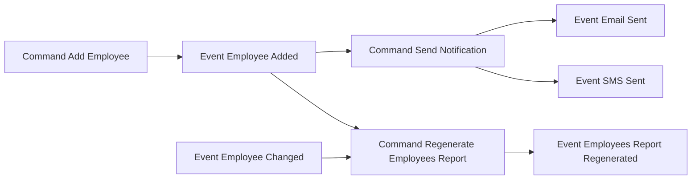

# Events Flow

## Example

See full example [here](../../../src/Samples/EventsFlow/Modeler.EventsFlowModel.Sample).

## Metamodel

TODO

## Design

### Commands

You can define Commands by inheriting from `Command` base class as follows:

```csharp
public class AddEmployeeCommand : Command
{
    public static Command Create() => new AddEmployeeCommand()
        .WithName("Add Employee");
}
```

### Events

You can define Events by inheriting from `Event` base class as follows:

```csharp
public class EmployeeAddedEvent : Event
{
    public static Event Create() => new EmployeeAddedEvent()
        .WithName("Employee Added");
}
```

### Flow

To create a flow, you need to define flow model by inheriting from `FlowModel` base class and define triggers (command -> event, event -> command):

```csharp
public class HRFlowModel : FlowModel
{
    public static void Create(HREventsFlowModel model)
    {
        var addEmployeeCommand = model.GetCommand<AddEmployeeCommand>();
        var sendNotificationCommand = model.GetCommand<SendNotificationCommand>();
        var regenerateEmployeesReportCommand = model.GetCommand<RegenerateEmployeesReportCommand>();
        
        var employeeAddedEvent = model.GetEvent<EmployeeAddedEvent>();
        var employeeChangedEvent = model.GetEvent<EmployeeChangedEvent>();
        var emailSentEvent = model.GetEvent<EmailSentEvent>();
        var smsSentEvent = model.GetEvent<SmsSentEvent>();
        var employeesReportRegeneratedEvent = model.GetEvent<EmployeesReportRegeneratedEvent>();

        addEmployeeCommand.Triggers(employeeAddedEvent);
        employeeAddedEvent.Triggers(sendNotificationCommand);
        employeeAddedEvent.Triggers(regenerateEmployeesReportCommand);
        sendNotificationCommand.Triggers(emailSentEvent);
        sendNotificationCommand.Triggers(smsSentEvent);
        employeeChangedEvent.Triggers(regenerateEmployeesReportCommand);
        regenerateEmployeesReportCommand.Triggers(employeesReportRegeneratedEvent);
    }
}
```

## Views

### Mermaid

#### Flow Diagram

You can create Mermaid flow diagram based on your model by inheriting from `MermaidEventFlowsViewDefinition` as follows:

```csharp
public class HREventsFlowViewDefinition : MermaidEventFlowsViewDefinition
{
    public const string Id = "HREventsFlowView";
    
    public static MermaidEventFlowsView Create(HREventsFlowModel model)
    {
        var flowElements = new List<FlowElement>
        {
            model.GetCommand<AddEmployeeCommand>(),
            model.GetCommand<SendNotificationCommand>(),
            model.GetCommand<RegenerateEmployeesReportCommand>(),
            model.GetEvent<EmployeeAddedEvent>(),
            model.GetEvent<EmployeeChangedEvent>(),
            model.GetEvent<EmailSentEvent>(),
            model.GetEvent<SmsSentEvent>(),
            model.GetEvent<EmployeesReportRegeneratedEvent>(),
        };
        var view = new MermaidEventFlowsView(
            Id,
            flowElements);

        return view;
    }
}
```

What you need to do is to select elements (events, commands) which should be visible on the view.

Output:



### Markdown

You can generate a Markdown table showing commands and events using `MarkdownEventsFlowViewGenerator`:

```csharp
public class HREventsFlowMarkdownViewDefinition : MarkdownEventFlowsViewDefinition
{
    public const string Id = "HREventsFlowMarkdown";

    public static MarkdownEventFlowsView Create(HREventsFlowModel model)
    {
        return new MarkdownEventFlowsView(Id, model);
    }
}
```

Output: [HREventsFlow table](HREventsFlow.md)
