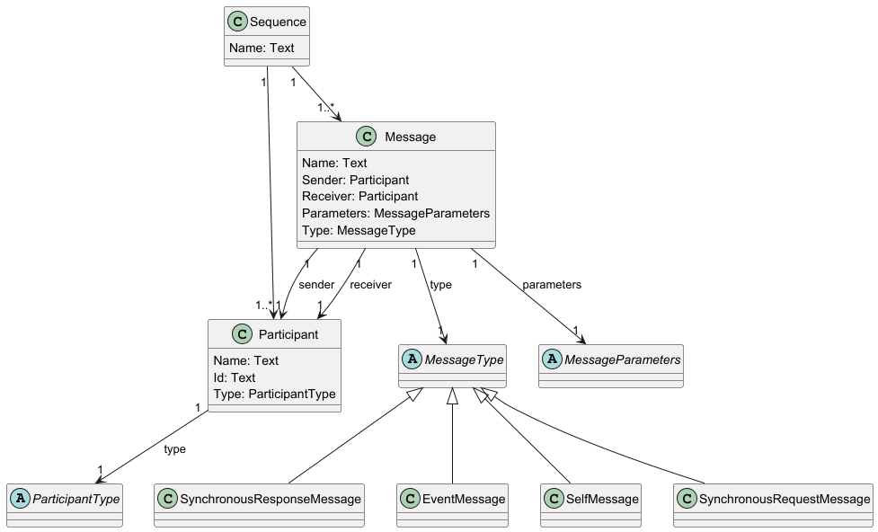
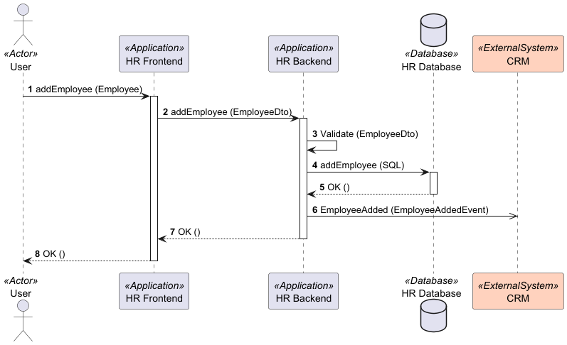
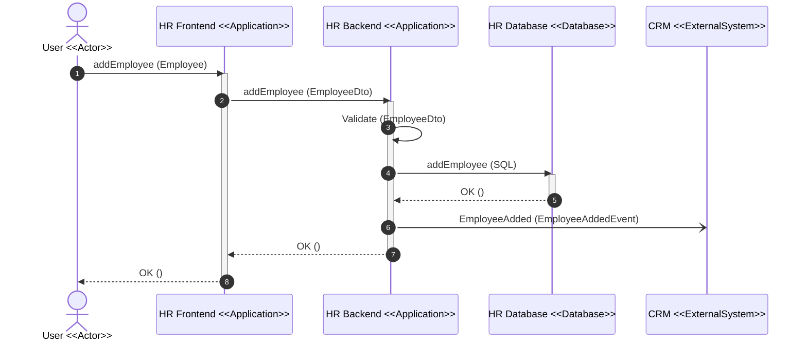

# Sequence

## Example

See full example [here](../../../src/Samples/Sequence/Modeler.SequenceModel.Sample).

## Metamodel



## Design

### Participant Types

Before you will be able to define Participants, you must define Participant Types by inheriting from `ParticipantType` base class as follows:

```csharp
public class Actor : ParticipantType
{
    public static Actor Create() => new Actor();
}
```

### Participants

To define Participant, you must inherit from `Participant` base class and set its name and type:

```csharp
public class HRBackendParticipant : Participant
{
    public static Participant Create() => new HRBackendParticipant()
        .WithName("HR Backend")
        .OfType(new ParticipantTypes.Application());
}
```

### Message Parameters

Messages can have different parameters. You can define them and then present on the view as you like:

```csharp
public class NoMessageParameters : MessageParameters
{
}
```

```csharp
public class StringMessageParameter : MessageParameters
{
    public StringMessageParameter(string name)
    {
        Name = name;
    }

    public string Name { get; }
}
```

### Sequences

The main part of the model are sequences. You can define as many as you like sequences by inheriting from `Sequence` base class and define participants and messages between them in concrete order:

```csharp
public class HRSystemFlowSequence : Sequence
{
    public static void Create(HRSequencesModel model)
    {
        var user = model.GetParticipant<UserParticipant>();
        var frontend = model.GetParticipant<FrontendParticipant>();
        var backend = model.GetParticipant<HRBackendParticipant>();
        var backendDatabase = model.GetParticipant<HRDatabaseParticipant>();
        var crm = model.GetParticipant<CrmParticipant>();

        var builder = new SequenceBuilder<HRSystemFlowSequence>("HR System Flow Sequence");

        builder.AddSynchronousRequestMessage(user, "addEmployee", new StringMessageParameter("Employee"), frontend);
        builder.AddSynchronousRequestMessage(frontend, "addEmployee", new StringMessageParameter("EmployeeDto"), backend);
        
        builder.AddSelfMessage(backend, "Validate", new StringMessageParameter("EmployeeDto"));
        
        builder.AddSynchronousRequestMessage(backend, "addEmployee", new StringMessageParameter("SQL"), backendDatabase);
        builder.AddSynchronousResponseMessage(backendDatabase, "OK", new NoMessageParameters(), backend);
        builder.AddEventMessage(backend, "EmployeeAdded", new StringMessageParameter("EmployeeAddedEvent"), crm);
        builder.AddSynchronousResponseMessage(backend, "OK", new NoMessageParameters(), frontend);
        
        builder.AddSynchronousResponseMessage(frontend, "OK", new NoMessageParameters(), user);

        var sequence = builder.Build();
        model.AddSequence(sequence);
    }
}
```

## Views

### PlantUML & Mermaid

#### Sequence diagram

Both PlantUML and Mermaid sequence diagrams are supported. To create a view, inherit from `SequenceDiagramViewDefinition` and decide which sequence you want to show and which participants:

```csharp
public class BasicSequenceView : SequenceDiagramViewDefinition
{
    public const string Id = "BasicSequence";
    
    public static SequenceDiagramView Create(HRSequencesModel model)
    {
        var participantsToShow = new List<Participant>
        {
            model.GetParticipant<UserParticipant>(),
            model.GetParticipant<FrontendParticipant>(),
            model.GetParticipant<HRBackendParticipant>(),
            model.GetParticipant<HRDatabaseParticipant>(),
            model.GetParticipant<CrmParticipant>()
        };
        var view = new SequenceDiagramView(
            Id,
            model.GetSequence<HRSystemFlowSequence>(),
            participantsToShow,
            autonumberMessages: true);

        return view;
    }
}
```

PlantUML output:



Mermaid output:

